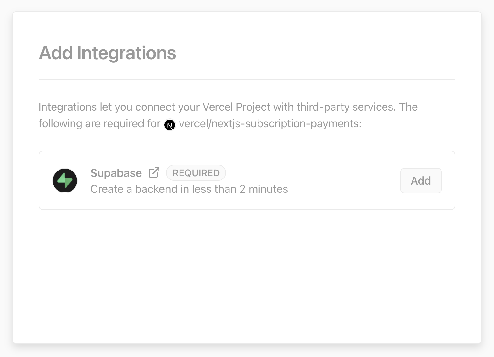

# Rocket Rosters
- website: https://rocket-nine.vercel.app/ 

## Overall Description


## Deploy with Vercel

The Vercel deployment will guide you through creating a Supabase account and project. After installing the Supabase integration, you'll need to configure Stripe with a few simple steps.

**Note:** We're working on our Stripe integration. We've documented the required steps below under "Configure Stripe" until the integration is ready.

To get started, click the "Deploy with Vercel" button below.

[](https://vercel.com/new/git/external?repository-url=https%3A%2F%2Fgithub.com%2Fvercel%2Fnextjs-subscription-payments&project-name=nextjs-subscription-payments&repo-name=nextjs-subscription-payments&demo-title=Next.js%20Subscription%20Payments%20Starter&demo-description=Demo%20project%20on%20Vercel&demo-url=https%3A%2F%2Fsubscription-payments.vercel.app&demo-image=https%3A%2F%2Fsubscription-payments.vercel.app%2Fdemo.png&integration-ids=oac_jUduyjQgOyzev1fjrW83NYOv&external-id=nextjs-subscription-payments)

[](https://vercel.com/new/git/external?repository-url=https%3A%2F%2Fgithub.com%2Fvercel%2Fnextjs-subscription-payments&project-name=nextjs-subscription-payments&repo-name=nextjs-subscription-payments&demo-title=Next.js%20Subscription%20Payments%20Starter&demo-description=Demo%20project%20on%20Vercel&demo-url=https%3A%2F%2Fsubscription-payments.vercel.app&demo-image=https%3A%2F%2Fsubscription-payments.vercel.app%2Fdemo.png&integration-ids=oac_jUduyjQgOyzev1fjrW83NYOv&external-id=nextjs-subscription-payments)

Once the project has deployed, continue with the configuration steps below.

### Generate types from your Supabase database

You can use the [Supabase CLI](https://supabase.com/docs/reference/cli/usage#supabase-gen-types-typescript) to generate types from your Database by running

1. To install supabase cli

```bash
npm install supabase --save-dev
yarn add supabase --dev
```

2. Connect to supabase

```bash
npx supabase login
```

3. Enter your access token. You can generate an access token from https://app.supabase.com/account/tokens
4. Generate types

```bash
npx supabase gen types typescript --project-id [YOUR-PROJECT-REF] --schema public > types_db.ts
```

### That's it

That's it. Now you're ready to earn recurring revenue from your customers 🥳

## Going live

### Archive testing products

Archive all test mode Stripe products before going live. Before creating your live mode products, make sure to follow the steps below to set up your live mode env vars and webhooks.

### Configure production environment variables

To run the project in live mode and process payments with Stripe, modify the environment variables from Stripe "test mode" to "production mode." After switching the variables, be sure to redeploy the application.

To verify you are running in production mode, test checking out with the [Stripe test card](https://stripe.com/docs/testing). The test card should not work.

### Redeploy

Afterward, you will need to rebuild your production deployment for the changes to take effect. Within your project Dashboard, navigate to the "Deployments" tab, select the most recent deployment, click the overflow menu button (next to the "Visit" button) and select "Redeploy."

## Develop locally

Deploying with Vercel will create a repository for you, which you can clone to your local machine.

Next, use the [Vercel CLI](https://vercel.com/download) to link your project:

```bash
vercel login
vercel link
```

### Setting up the env vars locally

Use the Vercel CLI to download the development env vars:

```bash
vercel env pull .env.local
```

Running this command will create a new `.env.local` file in your project folder. For security purposes, you will need to set the `SUPABASE_SERVICE_ROLE_KEY` manually from your [Supabase dashboard](https://app.supabase.io/) (Settings > API). Lastly, the webhook secret differs for local testing vs. when deployed to Vercel. Follow the instructions below to get the corresponding webhook secret.

### Install dependencies and run the Next.js client

```bash
npm install
npm run dev
# or
yarn
yarn dev
```
